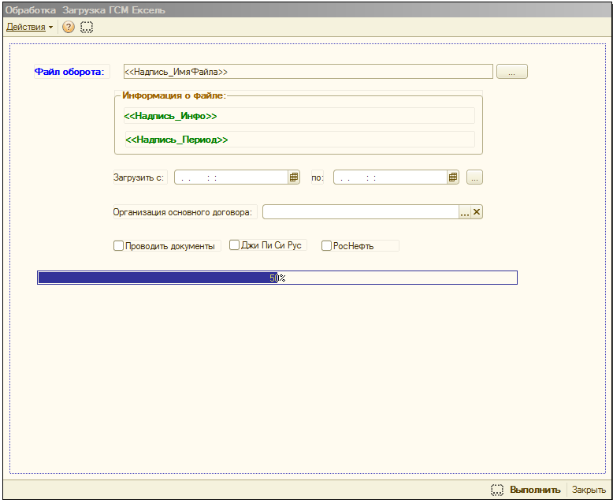

# GSM_Excel

Загрузка данных ГСМ (горюче-смазочных материалов) из файлов Excel в 1С:Предприятие.

## Описание

Внешняя обработка для автоматической загрузки данных о заправках ГСМ из Excel-файлов в документы "Учет ГСМ" в конфигурации 1С:Предприятие.

## Поддерживаемые форматы файлов

- GPS-мониторинг
- РН (реестр номеров)
- НВ (нормы времени)
- Стандартный формат

## Основные возможности

- Выбор Excel-файла через диалог
- Определение периода данных и количества записей
- Фильтрация по периоду загрузки
- Поиск карт ГСМ, водителей и перевозчиков
- Проверка дублей документов
- Автоматическое проведение документов

## Установка

1. Скопируйте файл `ЗагрузкаГСМексель.epf` в каталог обработок 1С:Предприятие
2. Откройте обработку в режиме 1С:Предприятие

## Использование

1. Выберите формат файла (галки в верхней части формы)
2. Нажмите "Выбор файла" и укажите путь к Excel-файлу
3. Укажите период загрузки
4. Выберите организацию основного договора
5. Нажмите "Выполнить"

## Разработчик

© Роман Мощёнский, Canabis220, 2013
